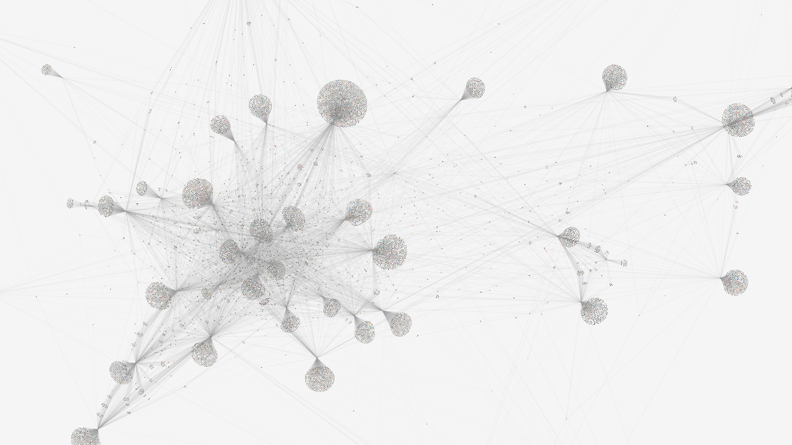

# Insta(nt)-Graph

A tool to create a visual representation how accounts are following each other on [Instagram](https://instagram.com).



**NOTE: THIS TOOL IS NOT ASSOCIATED OR ENDORSED BY INSTAGRAM OR META. USE AT YOUR OWN RISK.**

## Usage

Make sure [Node.js >= v20.x](https://nodejs.org/) is installed on your system.

Download or clone this repository on your machine. Then install the project dependencies via

```
npm install
```

To compile and run the program use

```
npm run cli
```

The result will be stored in a JSON file. Additionally, an interactive visualization is generated as a single HTML file,
which can be viewed in any modern Browser. The tool will stop early if it receives an `SIGINT`-Signal (when pressing
`CTRL+C` for example) and create the output for the current state.

### Options

| Name                   | Environment variable     | Description                                                                                                                                                                         | Default value |
|------------------------|--------------------------|-------------------------------------------------------------------------------------------------------------------------------------------------------------------------------------|---------------|
| Session ID             |                          | The session ID used by Instagram to authenticate the user. It can be attained either by logging in via the tool or through the data stored by the official Instagram web app.       |
| Root account           |                          | The account from which the graph generation should start.                                                                                                                           |               |
| Generations            |                          | The distance between the root account and the current user. It is defined by the number of accounts between them. Generation 0, therefor, only includes the root account.           | 1             |
| Maximal follower count |                          | Maximum amount of followers to fetch for each account. If more followers are over-fetched, they will be included but not further queried. It also applies to the followed accounts. | 250           |
| Include following      |                          | Also fetch the accounts are followed by an account, not only their followers.                                                                                                       | Yes           |
|                        | `RATE_BATCH_SIZE`        | How many followers can be fetched before pausing. This is determined by the total account count in the graph. The batch size should not exceed 9000. Less then 5000 is recommended. | 3000          |
|                        | `RATE_BATCH_COUNT`       | How many consecutive batches can executed before pausing between them. Should not exceed 20.                                                                                        | 15            |
|                        | `RATE_PARALLEL_TASKS`    | How many requests to Instagram can be executed in parallel.                                                                                                                         | 3             |
|                        | `RATE_DELAY_IMAGES_MAX`  | How long to wait at most before downloading a profile image in seconds.                                                                                                             | 5             |
|                        | `RATE_DELAY_IMAGES_MIN`  | How long to wait at least before downloading a profile image in seconds.                                                                                                            | 1             |
|                        | `RATE_DELAY_PAGES_MAX`   | How long to wait at most before sending a new request to Instagram in seconds.                                                                                                      | 60            |
|                        | `RATE_DELAY_PAGES_MIN`   | How long to wait at least before sending a new request to Instagram in seconds.                                                                                                     | 30            |
|                        | `RATE_DELAY_BATCHES_MAX` | How long to wait at most between batches in minutes.                                                                                                                                | 60            |
|                        | `RATE_DELAY_BATCHES_MIN` | How long to wait at least between batches in minutes.                                                                                                                               | 30            |
|                        | `RATE_DELAY_DAILY_MAX`   | How long to wait at most between consecutive batches once the set batch count is reached in hours.                                                                                  | 30            |
|                        | `RATE_DELAY_DAILY_MIN`   | How long to wait at least between consecutive batches once the set batch count is reached in hours.                                                                                 | 25            |

The actual wait-time is always determine at random and between the `MIN` and `MAX` values.

### Handling of errors and Instagram's rate limits

To not be flagged as automated behaviour, the tool needs to pause for a while after retrieving a lot of followers. The
tool will output the current state in the meanwhile.

Also, if an error occurs, the tool will try to output the current state. This might fail if the error is unhandled.

### Running the tool on a VPS

If you wish to run this tool on a VPS due to its long-running nature, you may be unable to use the login functionality
of this
tool as captchas are not handled.

Another issue you might run into is Node.js running out of memory if your VPS does not have an adequate amount of RAM.
To
work around this, you enable SWAP within your VPS and explicitly allow Node.js to use more memory via
[`--max-old-space-size`](https://nodejs.org/api/cli.html#--max-old-space-sizesize-in-megabytes).
